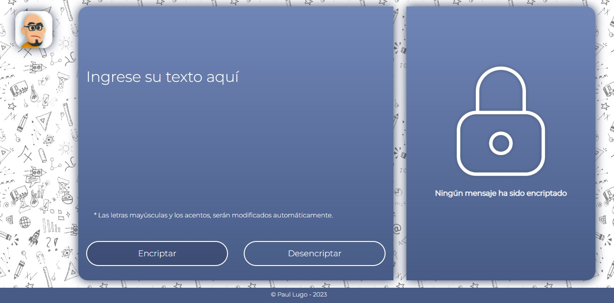

# Encriptador-Desencriptador

## Programa ONE de Oracle y Alura Latam

  

    

## Link del sitio:

Pagina : [encriptar-desencriptar.github.io](https://spiderpaul.github.io/encriptar-desencriptar.github.io/)

## Descripción del proyecto

Este proyecto forma parte del primer Challenge del programa Oracle Next Education (ONE), impartido por Oracle y Alura Latam. Se trata de un encriptador y desencriptador de texto básico, desarrollado con la utilización de HTML, CSS y JavaScript. 

## Llaves de encriptacion

Las llaves de encriptación utilizadas para el proyecto son las siguientes:

- La letra **"e"** es convertida para **"enter"**
- La letra **"i"** es convertida para **"imes"**
- La letra **"a"** es convertida para **"ai"**
- La letra **"o"** es convertida para **"ober"**
- La letra **"u"** es convertida para **"ufat"**

## Para desencriptar

- La letra **"enter"** es convertida para **"e"**
- La letra **"imes"** es convertida para **"i"**
- La letra **"ai"** es convertida para **"a"**
- La letra **"ober"** es convertida para **"o"**
- La letra **"ufat"** es convertida para **"u"**

## 📋Requisitos:

- Debe funcionar solo con letras minúsculas
- No deben ser utilizados letras con acentos
- Debe ser posible convertir una palabra para la versión encriptada también devolver una palabra encriptada para su versión original.

` Por ejemplo: "gato" => "gaitober" "gaitober" => "gato"`
